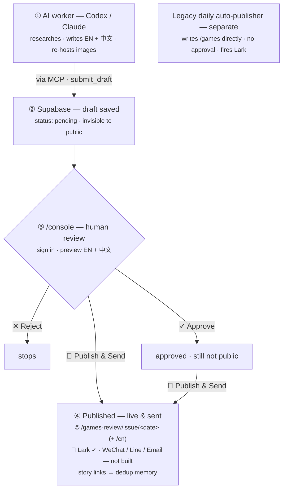

# The full web flow (approval pipeline)

How an issue travels from AI to readers. This is the **approval pipeline** (`games-review` track). The legacy daily auto-publisher (`games` track) runs separately and is shown at the bottom.

## Stage by stage

1. **Produce** — an AI worker (Codex today, any MCP-capable AI tomorrow) connects to the `bonfire` MCP server, reads the brief and the dedup archive, researches SEA games **business** news, writes the issue in **English + Chinese**, re-hosts each image, and calls `submit_draft` with `newsletter: "games-review"`. It has **no publish tool**.
2. **Store** — the draft lands in Supabase as `status = pending`. Row-level security means the public site cannot see it; `/games-review/issue/<date>` returns 404.
3. **Review** — a human signs in to **`/console`**, opens the draft, previews the English and Chinese renderings, and chooses:
   - **Reject** → `rejected` (stops here; its URLs are not burned for dedup).
   - **Approve** → `approved` (recorded, but still not public).
   - **🚀 Publish & Send** → `published`.
4. **Publish** — on publish: the issue's story URLs are written to the dedup archive; the pages go live at `/games-review/issue/<date>` (+ `/cn`); and the channels fire. **Lark is wired**; WeChat / Line / Email are placeholders (see `/console/channels`).

**Legacy lane:** the original daily scheduled task still writes the `games` track (`/games`) straight to `published` and fires Lark — **no approval gate**. It is deliberately kept separate so it can never overwrite an approved `games-review` issue.

Related: [approval-platform-mvp](approval-platform-mvp.md) · [channels-and-webhooks](channels-and-webhooks.md) · [pipeline-architecture](pipeline-architecture.md)
